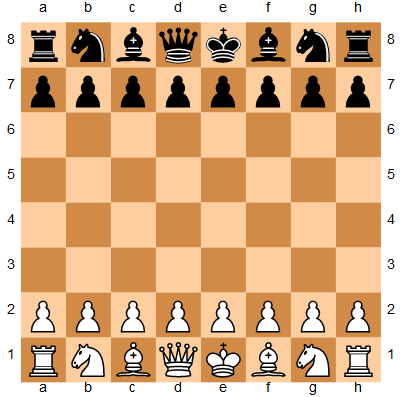

# Building a Chess AI

In this project I use the minimax algorithm with alpha-beta pruning to create a Chess AI that can play
against a human. The code is written in Python using the [python-chess](https://python-chess.readthedocs.io/en/latest/) library.

### Usage
On your local machine, clone the repository by typing:
```console
git clone https://github.com/Ajay-Chopra/chess-ai.git
```
In order to run the program, you will need to have python-chess installed. This can be done with:
```console
pip install python-chess
```
Once you have the necessary libraries installed run the program with the following commands:
```console
cd chess-ai
python chess_ai.py
```
You should see a starting chess board and a welcome message:
```console
WELCOME TO CHESS
---------------------------------------------------------------------
Enter moves in the form: r1f1r2f2
For example if you wanted to move from F2 to F3 you would type f2f3
---------------------------------------------------------------------
r n b q k b n r
p p p p p p p p
. . . . . . . .
. . . . . . . .
. . . . . . . .
. . . . . . . .
P P P P P P P P
R N B Q K B N R
---------------------------------------------------------------------
Please enter a move. Type DONE when finished
```
By default you are playing as the uppercase pieces. Simply enter your move and the program should handle it from there!

##### Using the Jupyter Notebook
If you desire a more elaborate chessboard representation and you have jupyterlab installed, you can use the
chess.ipynb file. We can use an SVG component to display the board like so:





